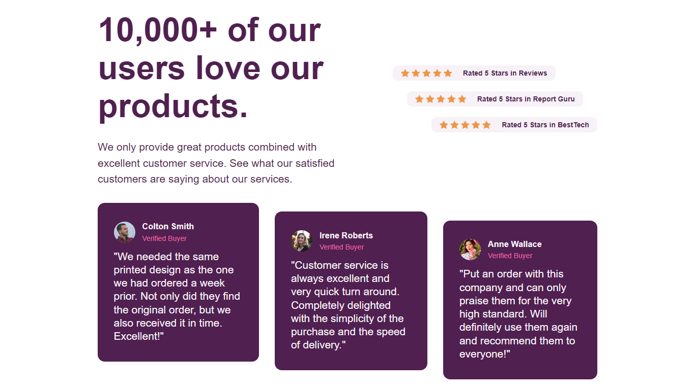
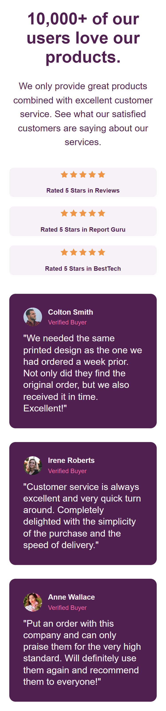

# Frontend Mentor - Social proof section solution

This is a solution to the [Social proof section challenge on Frontend Mentor](https://www.frontendmentor.io/challenges/social-proof-section-6e0qTv_bA). Frontend Mentor challenges help you improve your coding skills by building realistic projects.

## Table of contents

- [Overview](#overview)
  - [The challenge](#the-challenge)
  - [Screenshot](#screenshot)
  - [Links](#links)
- [My process](#my-process)
  - [Built with](#built-with)
  - [What I learned](#what-i-learned)
- [Author](#author)

## Overview

### The challenge

Users should be able to:

- View the optimal layout for the section depending on their device's screen size

### Screenshots

### Links

- You can see [my solution here](https://www.frontendmentor.io/solutions/social-proof-section-solution-B8kGBlUJRO)
- View the [live site demo here](https://social-proof-section-five-beige.vercel.app/)

## My process

### Built with

- Semantic HTML5 markup
- SCSS custom properties
- Flexbox
- CSS Grid
- Desktop-first workflow
- [SASS (.scss)](https://sass-lang.com/) - CSS Preprocessor

### What I learned

I got more familiar with layouts. The `align-self` css property became clear to me.

## Author

<!-- - LinkedIn -  -->

- Frontend Mentor - [@brown-ctrl](https://www.frontendmentor.io/profile/brown-ctrl)
- Twitter - [@memoye_io](https://www.twitter.com/memoye_io)

<!--
## Acknowledgments

This is where you can give a hat tip to anyone who helped you out on this project. Perhaps you worked in a team or got some inspiration from someone else's solution. This is the perfect place to give them some credit.

**Note: Delete this note and edit this section's content as necessary. If you completed this challenge by yourself, feel free to delete this section entirely.** -->
